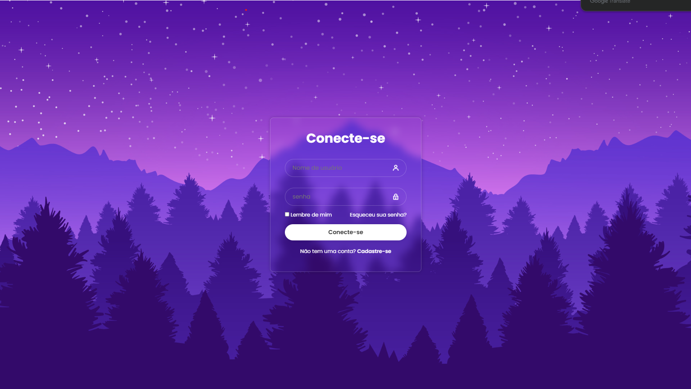

# 🌌 Purple Night Login

Uma tela de login moderna inspirada em uma paisagem noturna em tons de roxo.  
O projeto foi desenvolvido utilizando **HTML5 e CSS3**, com foco em design moderno, centralização com Flexbox e efeito glassmorphism.

---

## 📸 Preview

Adicione aqui uma imagem do projeto:

---

## 🚀 Funcionalidades

- 🌌 Background com gradiente roxo
- ✨ Efeito de estrelas
- 🌲 Silhueta de montanhas e árvores
- 🪟 Card com efeito Glassmorphism
- 🔐 Campos com ícones
- 📱 Layout responsivo
- 🎨 Design moderno e minimalista

---

## 🛠️ Tecnologias Utilizadas

- HTML5  
- CSS3  
- Flexbox  
- Google Fonts (Poppins)  
- Boxicons  

---

## 📂 Estrutura do Projeto

`├── index.html`
`├── style.css`
`├── img/`
`│ └── background.png`
`└── README.md`

---
## 🎨 Conceitos Aplicados

- `display: flex`
- `justify-content` e `align-items`
- `backdrop-filter`
- `linear-gradient`
- `position: absolute`
- `transition`
- `hover effects`
- Responsividade com `vw` e `vh`

---

## 📱 Responsividade

O layout se adapta a diferentes tamanhos de tela utilizando:

- Unidades relativas (`vw`, `vh`)
- Flexbox
- Estrutura centralizada

---

## 💡 Objetivo do Projeto

Este projeto foi desenvolvido para:

- Praticar CSS moderno
- Criar interfaces elegantes
- Treinar responsividade
- Desenvolver projetos para portfólio

---

## 🔮 Melhorias Futuras

- ✅ Validação com JavaScript
- 🔐 Integração com backend
- 🌙 Alternância entre tema claro e escuro
- ✨ Animações mais avançadas

---

## 👩‍💻 Desenvolvido por

**Byanca Matos**

---

⭐ Se você gostou do projeto, deixe uma estrela no repositório!
